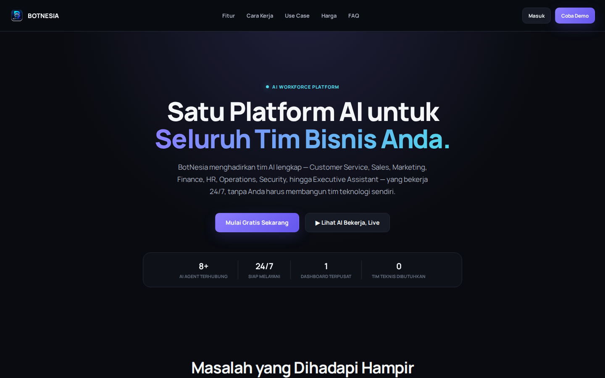
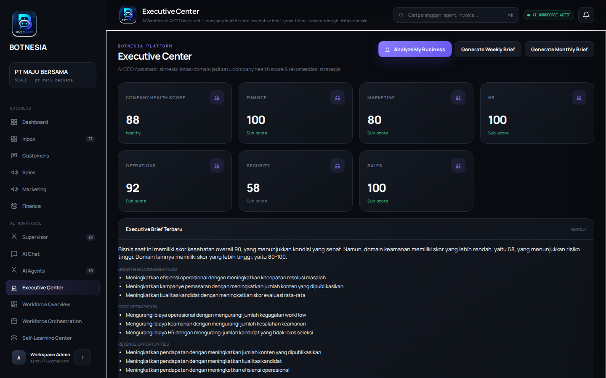
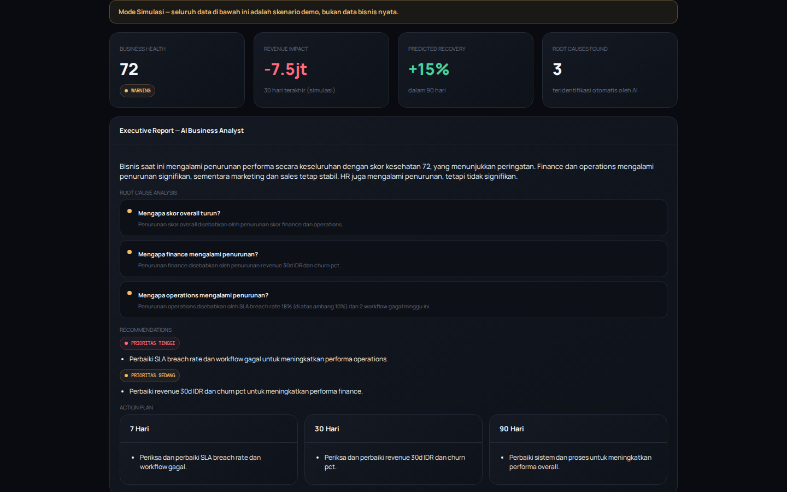

# BotNesia — Enterprise Multi-Agent AI Platform

**BotNesia is a production-deployed, multi-tenant Business AI Operating
System.** A Supervisor agent orchestrates a team of 25+ specialist agents —
Customer Service, Sales, Knowledge, Finance, Marketing, HR, Operations,
Security, Executive, Workforce Orchestrator, Self-Learning, and more — that
collaborate in real time to run the customer-facing chat pipeline and the
internal AI Workforce that operates the business itself.

Live at **[botnesia.uk](https://botnesia.uk)**. Built and run by one founder,
serving real tenants today — not a demo shell.

> **One-liner:** Trusted AI agents for business — every important AI decision is
> **anchored on Casper** as an immutable, independently verifiable proof.
> Verify a real one now:
> [deploy `fbb4b7e7…7b4e`](https://testnet.cspr.live/deploy/fbb4b7e766c0275980074d070d446d8e64703c2c2eb81be84637dfa531aa7b4e)
> · [contract `897c4bd6…a9f0`](https://testnet.cspr.live/contract-package/897c4bd670325c1f17ab1704633a470f55eeeb1ec2b357ef48e5d26ecb78a9f0).
>
> **Why now / why Casper:** businesses increasingly let AI make real decisions,
> but those decisions live in editable logs — unauditable and disputable. Casper
> turns each decision into a permanent, third-party-verifiable proof, making AI
> accountable by design.

> Submitted to **Casper Agentic Buildathon 2026**.
> 🎤 [Pitch Deck](docs/hackathon/PITCH_DECK.md) · [60s Elevator Pitch](docs/hackathon/ELEVATOR_PITCH.md) · [3-Min Demo Script](docs/hackathon/DEMO_SCRIPT.md) · [Architecture Diagrams](docs/hackathon/DIAGRAMS.md) · [Feature List](docs/hackathon/FEATURES.md) · [Roadmap](docs/hackathon/ROADMAP.md)

| | | | |
|---|---|---|---|
| ✔ Multi-Agent Collaboration | ✔ Autonomous AI | ✔ Long-Term Memory | ✔ Knowledge Engine |
| ✔ AI Workflow Automation | ✔ Human Approval Gate | ✔ Enterprise SaaS | ✔ Multi-Tenant |
| ✔ Secure Production Architecture | ✔ 1592 Automated Tests (0 failing) | ✔ 25+ Wired AI Agents | ✔ 5 Live Channels |
| ✔ Local Computer Agent | ✔ Real Midtrans Payments | ✔ Human Approval Queues | ✔ Live on botnesia.uk |

---

## Why this is an "Enterprise Multi-Agent AI Platform," concretely

| Requirement | Where it lives |
|---|---|
| **Autonomous AI Agents** | 25+ agent classes in `supervisor.py` (`SupervisorAgent.__init__`), each a self-contained `BaseAgent` subclass with its own prompt, tools, and `safe_run()` graceful-degradation contract |
| **Multi-Agent Collaboration** | `supervisor.py` `_process()` — intent routing → parallel specialist fan-out (`asyncio.gather`) → CS Agent synthesis → verification/critique loop → escalation gate, all in one real pipeline (not staged for demo) |
| **Long-Term Memory** | `memory_agent.py` — per-customer profile + cumulative `ConversationSummary` persisted across sessions, injected into every reply for continuity |
| **Knowledge Engine** | `knowledge_agent.py` + Auto Knowledge Builder (`knowledge_builder_agent.py`) — ingest PDF/DOCX/CSV/URL, auto-generate FAQ/SOP, human-approval publish gate into the live knowledge base |
| **Workflow Automation** | `workflow_engine.py` — visual, n8n-style trigger→condition→agent→action graph builder with retries and branching, plus a real Task Engine (`task_engine.py`): Goal → Plan → Subtasks → Tool Selection → Execution → Verification → Report |
| **Business AI Operating System** | 7 "AI Workforce" employees (Finance/Marketing/HR/Operations/Security/Executive/Workforce-Orchestrator) running the business's own back office, with a Self-Learning engine distilling real conversation/sales/complaint patterns into approved organizational knowledge |
| **Production Ready** | Real multi-tenant RBAC, JWT auth, audit logging, rate limiting, billing/subscriptions, 1592 automated tests (0 failing), live on a public domain behind Cloudflare with daily DB backups |

## Architecture at a glance

```
Customer ──HTTPS──> Cloudflare Tunnel ──> FastAPI (main.py)
                                              │
                                  ┌───────────┼────────────┐
                                  ▼           ▼            ▼
                          SupervisorAgent  RBAC/Billing  AI Workforce
                          (chat pipeline)  (bn_platform) (Finance/Mktg/HR/
                                  │                        Ops/Security/Exec)
                       ┌──────────┼──────────┐
                       ▼          ▼          ▼
                  CS/Sales/   Memory/    Verification/
                  Knowledge   Escalation Reasoning/Critique
                       │
                       ▼
                PostgreSQL 16 (single source of truth, RLS-style org_id
                scoping on every table)
```

Full diagrams and per-subsystem detail: [`docs/ARCHITECTURE.md`](docs/ARCHITECTURE.md).

## Feature map

- **AI Agents**: Supervisor, CS, Sales, Knowledge/FAQ, Memory, Escalation,
  Analytics, Trainer, Self-Learning, General AI, Research, Devil's Advocate,
  First-Principle, Planner/Reasoning/Verification, Identity — plus the 7
  AI Workforce domain agents above. Prompt routing between Standard and Pro
  (multi-lens reasoning) modes via `intent_classifier.py`.
- **Tool Framework**: real LLM function-calling (Groq, OpenAI-compatible
  `tools=`) — `database_query`, `web_search`, `browser_open/extract`,
  `financial_data`, `news_search`, `document_generator`, `email_reader`
  (Gmail), `channel_messaging` (WhatsApp/Telegram/Instagram/Facebook, gated
  behind a mandatory human-approval queue before anything is sent).
- **SaaS platform**: multi-tenant Organizations/Workspaces, Team & RBAC
  (owner/admin/manager/viewer/agent), Billing & Subscriptions
  (Midtrans/Xendit), API keys, Usage/Cost Intelligence, Security Dashboard
  (sessions, audit log, suspicious-login detection).
- **Omnichannel**: WhatsApp, Instagram, Facebook, Telegram, web widget — one
  unified inbox, one Human Handoff queue.
- **Frontend**: a single dark-themed dashboard SPA (`frontend/`, vanilla JS,
  no framework/build step) covering chat, conversations, analytics,
  knowledge builder, workflow builder, billing, security, and the full AI
  Workforce + Agent Center — responsive down to mobile.

## Screenshots

| Landing page | Executive Center | Investor Demo |
|---|---|---|
|  |  |  |

## Quickstart

```bash
git clone <this-repo>
cd "ai bisnis"
pip install -r requirements.txt
cp .env.example .env        # fill in SECRET_KEY, GROQ_API_KEY at minimum
./setup_db.sh                # bootstraps a local PostgreSQL 16 + pgvector
./start_postgres.sh &        # or: systemctl --user start botnesia-postgres.service
./migrate_database.sh
uvicorn main:app --host 0.0.0.0 --port 8000
```

Open `http://localhost:8000` for the landing page, `http://localhost:8000/dashboard`
for the authenticated SPA. The customer-facing chat endpoint is public:
`POST /chat/{bot_id}` (no auth — validated by `bot_id`).

Production runs the exact same code via systemd (`start_all.sh`) behind a
Cloudflare named tunnel — see [`docs/DEPLOYMENT.md`](docs/DEPLOYMENT.md).

## Tests

```bash
python3 -m pytest -q   # 1592 tests, all passing
```

## Current Status

Honest snapshot, not marketing copy:

- **Tests**: 1592 total, **all passing**, 0 failing, 3 skipped. (The former
  "pre-existing" document-generator failures were traced to a vendored Windows
  `PIL` shadowing system Pillow on the import path — fixed, which also removed a
  latent production risk to PDF/image generation.)
- **Local Computer Agent**: real and live — a downloadable script
  (`botnesia_local_agent.py`) connects a tenant's own PC to BotNesia over a
  WebSocket, giving the AI file/terminal/browser access on that machine with
  a human-approval gate for anything risky (`run_command`, file writes).
  Try it from **Agent Center** in the dashboard.
- **Billing (Midtrans)**: fully wired end-to-end against Midtrans
  **Production** — invoice creation, Snap token generation, hosted payment
  page, signed webhook notification, and idempotent invoice status updates
  are all confirmed working with real API calls. The one remaining step is
  outside our code: Midtrans's own business/KYC review for the merchant
  account, which gates real money movement on their side.
- **Infra**: FastAPI + PostgreSQL 16 running persistently (not ephemeral),
  behind a Cloudflare named tunnel with HTTPS, with a daily automated
  database backup (14-day retention).

## Try it yourself

**Billing** (`#billing` in the dashboard): open Billing → "Top Up
Percakapan" → choose the smallest package (Rp25.000) → you're redirected to
a real Midtrans Snap payment page → complete or cancel → you land back on
`/dashboard/billing`, which shows a live success/pending/failed banner
sourced only from Midtrans's server-to-server webhook (never trusted from
the redirect URL itself).

**Agent Center** (`#agent-center`): open Agent Center → download and run
the Local Agent script shown on the page → once connected, use "Tanya
Agent" to ask a Finance/Marketing/HR/Operations question in plain
Indonesian, or use the local-access test panel to list a folder or run a
command on your own machine → risky actions land in the **Antrian Izin —
Local Agent** approval queue until you approve them.

## Documentation

| Doc | Covers |
|---|---|
| [`docs/ARCHITECTURE.md`](docs/ARCHITECTURE.md) | System layers, AI Workforce phase-by-phase map, security patterns |
| [`docs/API.md`](docs/API.md) | Every REST endpoint, grouped by router |
| [`docs/DATABASE.md`](docs/DATABASE.md) | Schema, multi-tenant isolation strategy |
| [`docs/DEPLOYMENT.md`](docs/DEPLOYMENT.md) | Production topology, systemd services, migration runbook |
| [`docs/SECURITY.md`](docs/SECURITY.md) | Auth/JWT/RBAC, rate limiting, audit logging |
| [`docs/COST_INTELLIGENCE.md`](docs/COST_INTELLIGENCE.md) | Per-tenant AI cost tracking |

## Casper Agentic Workflow (Buildathon 2026)

BotNesia anchors every AI agent business decision to the **Casper Testnet** blockchain as an immutable, auditable proof — no one can alter what an agent decided after the fact.

### Demo flow

```
User describes business scenario
         │
         ▼
BotNesia SupervisorAgent analyzes it
  (25+ specialist agents collaborate)
         │
         ▼
Typed "Agent Action" created
  (hire / price_change / marketing / finance / ...)
         │
         ▼
SHA-256 hash computed → deployed to Casper Testnet
  via AI Proof Registry smart contract (store_proof entry point)
         │
         ▼
Deploy hash returned → stored in casper_proofs table
         │
         ▼
Dashboard card: Action Name · AI Decision · Casper Status · Tx Hash · Timestamp
         │
         ▼
Verify at: https://testnet.cspr.live/deploy/<hash>
```

### Smart Contract — deployed on Casper Testnet

| Field | Value |
|---|---|
| **Contract hash** | `15009cd4a6489c904b699c0a1f292e7e5557e823e54c236539c9ce9973ee2323` |
| **Contract package hash** | `897c4bd670325c1f17ab1704633a470f55eeeb1ec2b357ef48e5d26ecb78a9f0` |
| **Install deploy** | `f176f0b01541848d36834b9dc7d10f0dcfd9b921542c54ea11199ee8670620f8` |
| **Entry point** | `store_proof(session_hash, ai_action_hash, workflow_hash, invoice_hash, approval_hash, timestamp)` |
| **Source** | [`casper/contract/src/main.rs`](casper/contract/src/main.rs) |
| **Explorer** | [testnet.cspr.live/contract-package/897c…](https://testnet.cspr.live/contract-package/897c4bd670325c1f17ab1704633a470f55eeeb1ec2b357ef48e5d26ecb78a9f0) |

### API endpoints

| Method | Path | Description |
|---|---|---|
| `POST` | `/api/casper/workflow/action` | Record AI decision + anchor to Casper |
| `GET` | `/api/casper/workflow/actions` | List all anchored actions for the tenant |
| `GET` | `/api/casper/workflow/action/{id}` | Single action with full proof detail |
| `GET` | `/api/casper/workflow/stats` | Summary metrics (total, anchored, pending, by type) |
| `POST` | `/api/casper/workflow/demo` | One-click demo: pre-fill a sample business decision |
| `POST` | `/api/casper/anchor` | Legacy: anchor an arbitrary session hash |

### Database tables (additive, no existing tables touched)

```sql
agent_actions   — every AI business decision with typed action_type
casper_proofs   — deploy_hash, tx_status, explorer_url, proof_mode per action
```
Schema: [`casper/schema_casper.sql`](casper/schema_casper.sql)

### Files

| File | Purpose |
|---|---|
| `casper_anchor.py` | Core Casper Testnet deploy logic (pycspr, contract call) |
| `casper/workflow.py` | Agentic workflow: classify → decide → anchor → persist |
| `casper/schema_casper.sql` | Additive DB migration |
| `casper/contract/src/main.rs` | Rust smart contract source (AI Proof Registry) |
| `casper/test_casper_workflow.py` | 17 automated tests |
| `frontend/casper_widget.js` | "Anchor to Casper" topbar button |

### Local run

```bash
# Add to .env
CASPER_PVK_HEX=<ed25519-private-key-hex>
CASPER_PBK_HEX=<ed25519-public-key-hex>
CASPER_CHAIN=casper-test
CASPER_RPC_URL=https://node.testnet.casper.network/rpc

# Run (DB migration runs automatically on first request)
uvicorn main:app --port 8000
# Open: http://localhost:8000/casper
```

> **Demo mode** — if Casper keys are absent or testnet is unreachable, the
> system falls back to demo mode: a deterministic `demo-<hash>` is generated
> locally and the UI still shows all status fields. The real mode and demo
> mode use identical code paths; mode is recorded in `casper_proofs.proof_mode`.

### Compile the smart contract (optional)

```bash
cd casper/contract
rustup target add wasm32-unknown-unknown
cargo build --release --target wasm32-unknown-unknown
# WASM output: target/wasm32-unknown-unknown/release/ai_proof_registry.wasm
```

> Why Casper? Every AI agent decision becomes permanently verifiable — auditable by regulators, investors, or customers without trusting BotNesia's servers.

## Tech stack

FastAPI + asyncpg (PostgreSQL 16 + pgvector) · DeepSeek + OpenRouter
(multi-provider LLM routing, Groq fallback available) for LLM inference ·
vanilla JS SPA frontend (no build step) · Cloudflare Tunnel for HTTPS ·
Midtrans/Xendit for billing · **Casper Testnet** for on-chain AI session
anchoring.

## Folder structure

```
ai bisnis/
├── main.py                  # FastAPI app, auth, chat pipeline entrypoint, routing
├── supervisor.py            # SupervisorAgent — multi-agent orchestration (_process())
├── base.py                  # BaseAgent — shared LLM-call/tool-call/safe_run contract
├── task_engine.py           # Goal→Plan→Subtasks→Tool Selection→Execution→Verification
├── tool_executor.py         # Real LLM function-calling tool catalog + executors
├── *_agent.py               # One file per agent (cs, sales, knowledge, memory, finance,
│                             #   marketing, hr, operations, security, executive, ...)
├── channel_messaging.py     # Human-approval-gated outbound messaging persistence
├── bn_platform/              # Business Platform: RBAC, billing, security, omnichannel,
│   ├── rbac.py               #   knowledge builder, workflow engine routers, channel
│   ├── billing.py            #   connectors (bn_platform/channels/) — one router file
│   ├── security.py           #   per domain, mounted under /api in main.py
│   └── ...
├── intelligence/             # Conversation Memory, FAQ Engine, Sales Intelligence,
│   └── ...                   #   Knowledge Graph (pre-existing intelligence layer)
├── frontend/                 # Vanilla-JS dashboard SPA, no build step
│   ├── app.js                #   all page renderers + event dispatch
│   ├── components.js          #   shared UI primitives (icons, cards, nav, modals)
│   ├── api-client.js          #   typed fetch wrapper, one method per endpoint
│   └── landing.html           #   public marketing page (served at /)
├── docs/                     # Architecture, API, Database, Deployment, Security docs
│   └── hackathon/             #   pitch deck, demo script, diagrams, feature list, roadmap
├── casper/                   # Casper Agentic Workflow (Buildathon 2026)
│   ├── workflow.py           #   agentic workflow engine + FastAPI router
│   ├── schema_casper.sql     #   DB migration (agent_actions, casper_proofs)
│   ├── contract/             #   Rust smart contract source (AI Proof Registry)
│   └── test_casper_workflow.py
├── casper_anchor.py          # Core Casper Testnet deploy logic (pycspr)
├── schema.sql / bn_platform/schema_platform.sql   # Full DB schema (idempotent migrations)
├── test_*.py                 # 1592 backend tests, one file per module/feature
└── requirements.txt
```

## Security

- Secrets are never committed: `.env*` (except `.env.example`) is git-ignored.
  Strong `SECRET_KEY` is enforced by a startup guard (`STRICT_SECRETS=1` in prod).
- Multi-tenant isolation (`org_id` on every query), RBAC with server-side plan
  gating, signed media URLs, security headers, and IP-based rate limiting.
- CodeQL + Dependabot run on the repo; the AI model router redacts secret-like
  patterns from output and blocks prompt-injection attempts.
- Full policy: [`SECURITY.md`](SECURITY.md). Latest white-box audit and fixes:
  [`docs/SECURITY_AUDIT_BOTNESIA.md`](docs/SECURITY_AUDIT_BOTNESIA.md),
  [`docs/SECURITY_FIX_LOG.md`](docs/SECURITY_FIX_LOG.md).

## Buildathon submission (Casper Agentic Buildathon 2026)

- **Testing playbook (for reviewers):** [`docs/CASPER_FINAL_SUBMISSION_PLAYBOOK.md`](docs/CASPER_FINAL_SUBMISSION_PLAYBOOK.md)
- **Casper Testnet proofs** (contract package hash + sample confirmed transactions):
  [`docs/CASPER_TESTNET_PROOFS.md`](docs/CASPER_TESTNET_PROOFS.md)
- **Final-round checklist & manual steps:** [`docs/FINAL_ROUND_CHECKLIST.md`](docs/FINAL_ROUND_CHECKLIST.md)

Quick facts:
- Network: **Casper Testnet** (`casper-test`)
- Contract package hash: `897c4bd670325c1f17ab1704633a470f55eeeb1ec2b357ef48e5d26ecb78a9f0`
  ([explorer](https://testnet.cspr.live/contract-package/897c4bd670325c1f17ab1704633a470f55eeeb1ec2b357ef48e5d26ecb78a9f0))
- Sample confirmed tx: `fbb4b7e766c0275980074d070d446d8e64703c2c2eb81be84637dfa531aa7b4e`

## License

All rights reserved — see [`LICENSE`](LICENSE). This repository is public
for hackathon judging, investor, and partner evaluation purposes; it is
not licensed for reuse, modification, or redistribution.
