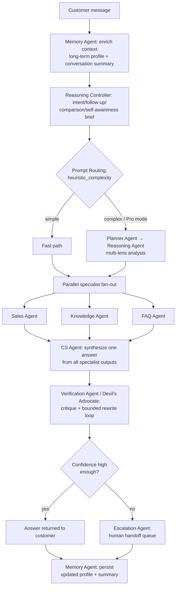
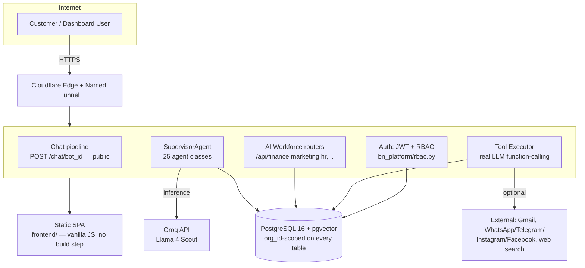

# BotNesia — Architecture Diagrams

Both diagrams below are drawn directly from the live code paths
(`supervisor.py::_process()` and the actual systemd/network topology), not
idealized/aspirational versions. Rendered with [Mermaid](https://mermaid.js.org)
(GitHub renders these natively).

## 1. AI Agent Collaboration Flow

This is the real per-message pipeline that runs on every customer chat
(`supervisor.py`'s `_process()`):



**Why this matters for judges:** the fan-out at step G runs with
`asyncio.gather` — genuinely concurrent specialist execution, not a
sequential if/else chain dressed up as "agents." The verification loop at
step I is a real second LLM pass that can reject and force a rewrite of
the first answer before it ever reaches the customer.

## 2. AI Workforce — autonomous task execution + approval gate

This is the separate pipeline used when an AI Workforce agent (Finance,
Marketing, HR, Operations, ...) is given a free-form goal via `run_task()`
(`task_engine.py`):

```mermaid
flowchart LR
    A[Goal: e.g. \"Kirim promo WhatsApp ke pelanggan X\"] --> B[Plan: LLM splits<br/>goal into 1-4 subtasks]
    B --> C[Tool Selection: filter to<br/>this agent's own allowlisted tools]
    C --> D[Execution: real LLM<br/>function-calling per subtask]
    D --> E{Tool is a<br/>write action?}
    E -->|read-only<br/>e.g. database_query| F[Executes immediately]
    E -->|write<br/>channel_messaging| G[Queues pending_approval row<br/>— NEVER sends directly]
    G --> H[Human reviews in<br/>Agent Center dashboard]
    H -->|Approve| I[Real send via ChannelManager]
    H -->|Reject| J[Discarded, reason logged]
    F --> K[Verification: did tool_calls<br/>actually answer the goal?]
    I --> K
    J --> K
    K --> L[agent_task_executions row:<br/>status completed/failed]
```

## 3. System Architecture



**Topology facts** (not aspirational — this is what's actually deployed):
single VM, single Postgres instance, single FastAPI process, behind a
Cloudflare named tunnel. `~/.local/share/botnesia/app` is a **symlink** to
this git working directory — `git commit` + `systemctl restart` is the
entire deploy process, no build/CI step in between. Full detail:
[`docs/DEPLOYMENT.md`](../DEPLOYMENT.md), [`docs/ARCHITECTURE.md`](../ARCHITECTURE.md).
