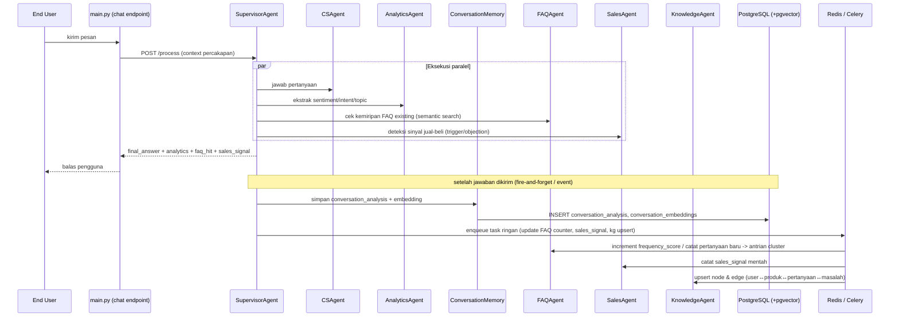

# BotNesia Intelligence Platform — Arsitektur

Tujuan: setiap percakapan yang masuk ke BotNesia menghasilkan **aset data jangka
panjang** yang membuat sistem makin pintar — Conversation Memory, FAQ Engine,
Sales Intelligence, Knowledge Graph, dan laporan Auto-Learning harian.

Sistem ini **memperluas** `agent_api.py` yang sudah ada (bukan service terpisah):
agent baru berjalan di proses yang sama, berbagi pool Postgres, Redis, dan
Supervisor yang sama dengan `cs_agent` / `analytics_agent` / dll.

---

## 1. Struktur Folder

```
ai bisnis/
├── main.py                     # BotNesia core API (existing)
├── agent_api.py                # Multi-agent FastAPI app (existing, + router intelligence)
├── supervisor.py               # Orkestrator agent (existing, + 3 agent baru terdaftar)
├── base.py / cs_agent.py / escalation.py / analytics.py / trainer.py / memory_agent.py  (existing)
├── celery_app.py               # ── BARU: konfigurasi Celery (broker = Redis)
├── schema.sql                  # existing (org/users/bots/conversations/messages/...)
│
└── intelligence/               # ══════ MODUL BARU ══════
    ├── __init__.py
    ├── ARCHITECTURE.md         # dokumen ini
    ├── schema_intelligence.sql # tabel baru: faq, sales_patterns, kg_*, dst (lihat §2)
    ├── config.py               # Settings tambahan (REDIS_URL, EMBEDDING_*, dsb)
    ├── db.py                   # pool asyncpg khusus modul + helper query umum
    ├── embeddings.py           # generator embedding lokal (hashing-trick) + util pgvector
    │
    ├── conversation_memory.py  # CONVERSATION MEMORY — persist + summary + embedding
    ├── faq_agent.py            # FAQ ENGINE — deteksi & cluster pertanyaan, scoring
    ├── sales_agent.py          # SALES INTELLIGENCE — trigger/objection/solution mining
    ├── knowledge_agent.py      # KNOWLEDGE GRAPH — User↔Produk↔Pertanyaan↔Masalah↔Solusi↔Penjualan
    │
    ├── nightly_jobs.py         # AUTO LEARNING — Celery tasks terjadwal (jam 02:00)
    ├── reports.py              # Generator laporan (Top FAQ/Complaint/Trigger/Path/Failed)
    │
    └── routes_intelligence.py  # FastAPI router: /intel/* (dashboard, faq, sales, kg, reports)
```

Modul `intelligence/` sengaja **tidak** menyentuh kode lama — ia hanya:
1. Di-`include_router()` ke `agent_api.py` (menambah endpoint `/intel/...`),
2. Mendaftarkan 3 agent (`FAQAgent`, `SalesAgent`, `KnowledgeAgent`) ke `SupervisorAgent`,
3. Menjalankan Celery worker + beat sebagai proses terpisah (lihat `docker-compose.yml`).

---

## 2. Skema Database (tabel baru — lihat `schema_intelligence.sql`)

```
organizations ─┬──< bots ─┬──< conversations ──< messages           (existing)
               │          │         │
               │          │         ├──< conversation_analysis      ── 1:1, hasil ekstraksi per percakapan
               │          │         │      (intent, sentiment, topic, outcome,
               │          │         │       lead_status, purchase_status, escalation_status, summary)
               │          │         │
               │          │         └──< conversation_embeddings    ── 1:1, vector(384) pgvector
               │          │
               │          ├──< faq_entries ──< faq_source_messages  ── FAQ ENGINE
               │          │      (question, answer, frequency_score,
               │          │       success_score, conversion_score, embedding)
               │          │
               │          ├──< sales_patterns ──< sales_signals     ── SALES INTELLIGENCE
               │          │      (trigger, objection, solution,
               │          │       conversion_rate, confidence_score)
               │          │
               │          ├──< kg_nodes ──< kg_edges ──> kg_nodes   ── KNOWLEDGE GRAPH
               │          │      (type: user|product|question|problem|solution|sale)
               │          │
               │          └──< learning_reports                    ── AUTO LEARNING (snapshot harian)
               │                 (top_faq, top_complaint, top_sales_trigger,
               │                  top_conversion_path, top_failed_conversation)
               │
               └──< customer_profiles ──< customer_facts            ── CUSTOMER INTELLIGENCE
                      (end_user_id, lifetime_value, lead_score,
                       churn_risk, preferred_topics, purchase_history)
```

Detail kolom & index ada di `schema_intelligence.sql`. Semua tabel mewarisi pola
existing: PK `UUID DEFAULT uuid_generate_v4()`, FK ke `organizations`/`bots`, index
pada `org_id`/`bot_id`, kolom `created_at`/`updated_at`.

Vector disimpan dengan ekstensi **pgvector** (`vector(384)`), dengan index
`ivfflat (embedding vector_cosine_ops)` untuk semantic search cepat di skala jutaan baris.

---

## 3. Alur Data (Workflow)

### 3.1 Real-time — tiap pesan masuk



### 3.2 Batch — Auto-Learning tiap malam (Celery beat 02:00)

```mermaid
flowchart LR
    A[Celery beat\ntrigger 02:00] --> B[nightly_jobs.run_daily_learning]
    B --> C[Tarik semua conversation_analysis\nH-1 per bot]
    C --> D[FAQAgent.cluster_questions\n→ buat/merge faq_entries\n→ hitung frequency/success/conversion score]
    C --> E[SalesAgent.mine_patterns\n→ agregasi sales_signals\n→ upsert sales_patterns + confidence_score]
    C --> F[KnowledgeAgent.rebuild_edges\n→ upsert kg_nodes/kg_edges\n→ hitung edge_weight dari frekuensi co-occurrence]
    D --> G[reports.generate_daily_report]
    E --> G
    F --> G
    G --> H[(learning_reports)\nTop FAQ / Top Complaint / Top Trigger\nTop Conversion Path / Top Failed Conversation]
    H --> I[Webhook opsional ke org\n+ tampil di /intel/dashboard]
```

### 3.3 Multi-Agent — berbagi pengetahuan

```
                         ┌────────────────────┐
                         │  SupervisorAgent    │
                         │  (orkestrasi)       │
                         └─────────┬───────────┘
        ┌───────────┬─────────────┼─────────────┬───────────────┐
        ▼           ▼             ▼             ▼               ▼
  ┌──────────┐ ┌──────────┐ ┌───────────┐ ┌───────────┐  ┌────────────┐
  │ CSAgent  │ │ Sales    │ │ FAQAgent  │ │ Analytics │  │ Knowledge  │
  │ (jawab)  │ │ Agent    │ │ (cek FAQ) │ │ Agent     │  │ Agent      │
  └────┬─────┘ └────┬─────┘ └─────┬─────┘ └─────┬─────┘  └─────┬──────┘
       │            │             │             │              │
       └────────────┴──────┬──────┴─────────────┴──────────────┘
                            ▼
                  ┌───────────────────┐         ┌───────────────┐
                  │ ConversationMemory │◄───────►│ TrainerAgent  │
                  │ (shared store)     │         │ (nightly tune)│
                  └─────────┬──────────┘         └───────────────┘
                            ▼
                 PostgreSQL + pgvector (single source of truth)
```

Setiap agent **membaca & menulis** ke store bersama (`conversation_memory`,
`faq_entries`, `sales_patterns`, `kg_*`) lewat `intelligence/db.py` —
sehingga "berbagi knowledge secara otomatis" terjadi melalui *shared state*,
bukan pesan langsung antar-agent (lebih scalable & auditable).

---

## 4. API Endpoints baru (`/intel/*`, didaftarkan di `agent_api.py`)

| Method | Path | Fungsi |
|---|---|---|
| `POST` | `/intel/conversations/{conv_id}/persist` | Simpan analisis + ringkasan + embedding percakapan (dipanggil Supervisor setelah `/process`) |
| `GET`  | `/intel/conversations/search` | Semantic search percakapan mirip (query → embedding → pgvector ANN) |
| `GET`  | `/intel/faq/{bot_id}` | List FAQ terbentuk (sort by frequency/success/conversion) |
| `POST` | `/intel/faq/{bot_id}/rebuild` | Trigger manual clustering FAQ (selain nightly) |
| `GET`  | `/intel/sales/{bot_id}/patterns` | List sales patterns (trigger/objection/solution + conversion_rate) |
| `GET`  | `/intel/sales/{bot_id}/objections` | Top objections + saran solusi |
| `GET`  | `/intel/knowledge-graph/{bot_id}` | Subgraph (nodes+edges) untuk visualisasi |
| `GET`  | `/intel/knowledge-graph/{bot_id}/related/{node_id}` | Node terkait (traversal 1-2 hop) |
| `GET`  | `/intel/dashboard/{bot_id}` | Ringkasan analytics (lihat §5) |
| `GET`  | `/intel/reports/{bot_id}/daily` | Laporan auto-learning (terbaru / by date) |
| `GET`  | `/intel/customers/{bot_id}/{end_user_id}` | Customer Intelligence profile |
| `POST` | `/intel/learning/run` | Trigger manual job auto-learning (admin/debug) |

Semua endpoint memakai header `x-agent-secret` yang sama dengan `/process`.

---

## 5. Analytics Dashboard — metrik

`GET /intel/dashboard/{bot_id}` mengembalikan:

```json
{
  "total_conversations": 12450,
  "faq_generated": 318,
  "top_intents": [{"intent": "tanya_harga", "count": 2210}, ...],
  "satisfaction_rate": 0.86,
  "conversion_rate": 0.12,
  "revenue_impact_estimate": 45000000,
  "knowledge_growth": {
    "faq_new_this_week": 14,
    "sales_patterns_new_this_week": 6,
    "kg_nodes_total": 5210,
    "kg_edges_total": 18733
  }
}
```

`revenue_impact_estimate` dihitung dari `sales_patterns.conversion_rate ×
rata-rata nilai transaksi (dari `customer_profiles.purchase_history` /
metadata org)` — fallback `0` bila data transaksi tak tersedia.

---

## 6. Infrastruktur Produksi

- **FastAPI** — `agent_api.py` tetap menjadi entrypoint; modul intelligence
  cukup `app.include_router(intel_router)`.
- **PostgreSQL + pgvector** — single source of truth + semantic search.
- **Redis** — broker Celery & cache hasil agregasi dashboard (TTL 5 menit).
- **Celery** (`celery_app.py` + `nightly_jobs.py`) — worker untuk task async
  ringan (persist embedding, update counter) & beat untuk job malam hari.
- **Docker** — `docker-compose.yml` baru menjalankan:
  `postgres(pgvector) | redis | agent_api | celery-worker | celery-beat`.
- **Clean Architecture** — `intelligence/` dipisah per *bounded context*
  (memory, faq, sales, knowledge graph), masing-masing punya:
  domain logic (agent class) ⇄ persistence (`db.py` helpers) ⇄ exposure (router).
- **Event-driven** — perubahan signifikan (`faq.created`, `pattern.detected`,
  `escalation.spike`) dipublikasikan lewat `dispatch_webhook()` (sudah ada di
  `main.py`) sehingga klien bisa bereaksi tanpa polling.
- **Skalabilitas** — semua tabel ber-index `org_id`/`bot_id`/`created_at`;
  agregasi berat (clustering, KG rebuild) dipindah ke Celery nightly agar jalur
  realtime tetap < 200 ms; pgvector `ivfflat` index menjaga semantic search tetap
  cepat hingga jutaan baris (partisi per bulan bisa ditambahkan saat volume > 50jt baris).
